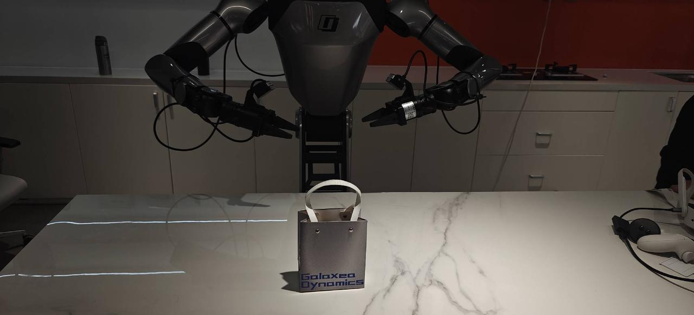
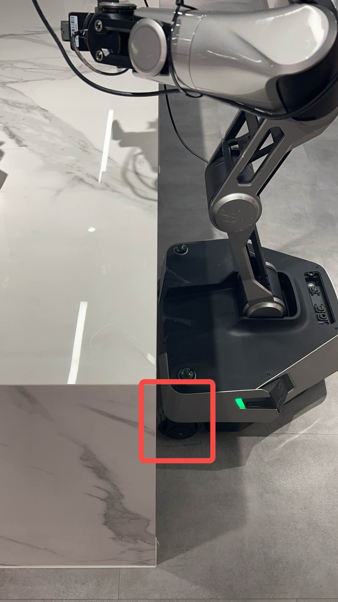
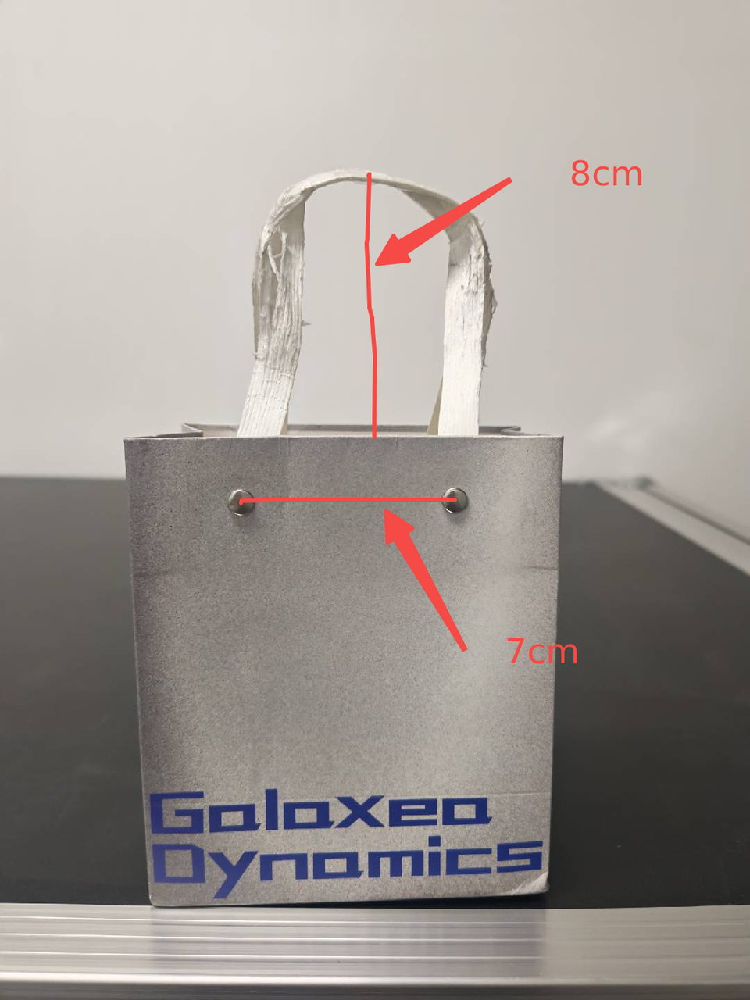

# Handover Gift User Guideline
We have implemented a complete on-device inference engine based on our self-developed G0tiny VLA model and NVIDIA JetPack 6.0, which includes:
1. An asynchronous inference framework based on TensorRT/CUDA, supporting real-time on-device VLA inference at up to 10 Hz
2. Post-processing weights in TensorRT Engine format and Fp16 precision
3. Trajectory post-processing based on splines

This provides users with an out-of-the-box VLA model experience. Below is the complete user setup guide.
## Prerequisites
The following items 1~3 in the prerequisites can be obtained from the after-sales team of GalaxeaAI. The `Torso Key` is used to unlock waist control. Considering that waist control may involve certain safety risks in unexpected usage scenarios, a disclaimer must be confirmed before it can be provided.
|index|Item|How to get|
|-|-|-|
|0|R1 Pro|---|https://galaxea-dynamics.com/products/galaxea-r1-pro-universal-humanoid-robot|
|1|Galaxea AI Teleoperation Copilot(ATC) Software|Contact the after-sales team(support@galaxea-ai.com) to get the software|
|2|Galaxea Embodiment Human Interface(EHI) Application|Contact the after-sales team(support@galaxea-ai.com) to get the application|
|3|Torso Key|Contact the after-sales team(support@galaxea-ai.com), sign a contract and obtain the key|
|4|Model TensorRT Engine|TODO: Huggingface link|
|5|Scene|Contact the after-sales team(support@galaxea-ai.com) to get objects' BOM|

## Scene
Our scene setup is shown below

<p align="center">
  
</p>


The front edge of the chassis's front wheels should be aligned with the edge of the table. The table height should be 90cm, which is critical for the robot to operate properly.

<p align="center">
  
</p>

To ensure experimental rigor, we have also provided the actual parameters of the gift bag used during testing. However, the model also exhibits a degree of generalizability to other similar bags.

<p align="center">
  
</p>

Paper bag dimensions: 7cm (width) * 5cm (depth) * 13cm (height).
Handle dimensions: Width 7cm, height 8cm.


## Setup
1. Copy the software to the robot
```bash
scp -r atc_system-V2.6.0-xxxx_aarch64.tar.gz nvidia@${ROBOT_IP}:/home/nvidia/galaxea/
```

2. Extract the software
```bash
ssh nvidia@${ROBOT_IP}
cd galaxea

# Remove the old software, better to make backup first
tar xvf atc_system-V2.6.0-xxxx_aarch64.tar.gz
```

After the software is extracted, you should see the following directory structure
```txt
/home/nvidia/galaxea/install/
```

3. Copy the model to the robot
```bash
# Make sure the model directory exists otherwise create it before copying
scp -r model nvidia@${ROBOT_IP}:/home/nvidia/.galaxea/model/
```

the final model directory tree should be like this
```bash
.
└── models
    ├── g0tiny_posttraining_handover
    │   ├── config.yaml
    │   ├── dataset_stats.json
    │   ├── galaxea_zero_tiny_encoder.engine
    │   └── galaxea_zero_tiny_predictor.engine
    └── model_cards.yaml
```

The model_cards.yaml file is used to store the model information, which is used to load the model when the robot starts up.

## Run
1. launch the ATC software on the robot
```bash
ssh nvidia@${ROBOT_IP}
cd /home/nvidia/galaxea/install/startup_config/share/startup_config/script/

./robot_startup.sh boot ../sessions.d/ATCSystem/R1PROATC.d/
```

2. launch EHI and send command


## Test Case
|Index| User Behavior|Expected Robot Behavior|
|-|-|-|
|0|Hand held open and stationary|places the gift|
|1| Hand held open and moving|follows and delivers|
|2|Hand closes into a fist and then reopens|retracts and then delivers|
|3|Gift is moved|follows, grasps, and delivers|
|4|Gift is knocked over| uprights it and delivers|


## Performance Benchmark
All the following experiments present real latency results tested on physical robots (Jetson AGX Orin 32G, with JetPack 6.0), with no significant difference observed in success rates. Reducing the number of denoising steps in G0Tiny leads to slight trajectory degradation, causing jitter and a marginal decrease in motion performance for the gift delivery task.
|number of denoising steps|lantency|Frequency|
|-|-|-|
|10|130 ms|7.7 Hz|
|2|97 ms|10.3 Hz|