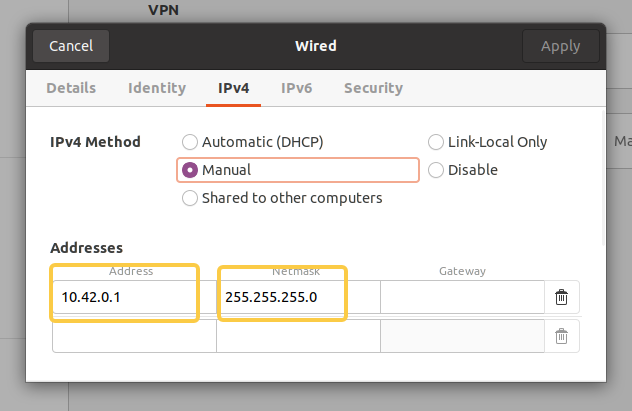

# Host and Robot Network Configuration

1. (Host) In `Settings -> Network`, configure the wired network as shown below. Disable the wired connection and then re-enable it for the changes to take effect.

     
  

2. (Robot) Connect a monitor to the robot's NUC, open `Settings -> Network`, also choose `Manual`, set the Address to `10.42.0.<robot>` (keep it the same as the robot's original IP), and set the Netmask to `255.255.255.0`; refer to the image above.

3. (Host) Verify that the host can ping the robot.